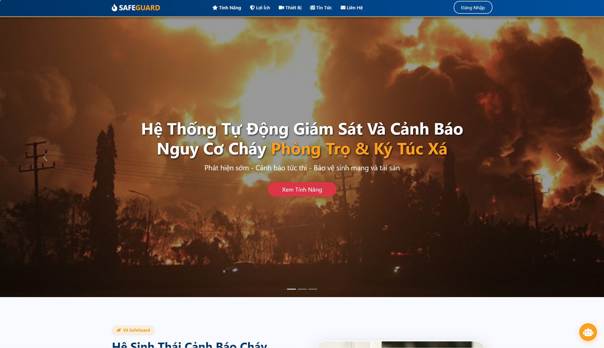
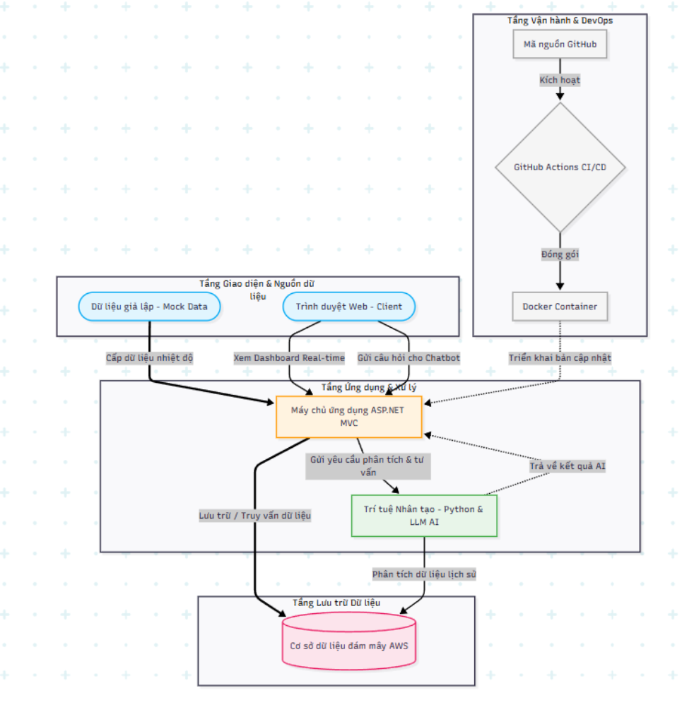

# 🛡️ SAFEGUARD - Hệ Thống Tự Động Giám Sát Và Cảnh Báo Nguy Cơ Cháy Thông Minh

> **Giải pháp đột phá ứng dụng IoT, AI và Cloud Computing trong quản lý an toàn phòng cháy chữa cháy cho các khu trọ và chung cư mini.**

---

## 📖 Mục lục
- [Giới thiệu dự án](#-giới-thiệu-dự-án)
- [Demo hệ thống](#-demo-hệ-thống)
- [Tính năng nổi bật](#-tính-năng-nổi-bật)
- [Kịch bản sử dụng](#-kịch-bản-sử-dụng)
- [Kiến trúc hệ thống](#-kiến-trúc-hệ-thống)
- [Công nghệ sử dụng](#-công-nghệ-sử-dụng)
- [Cấu trúc dự án](#-cấu-trúc-dự-án)
- [Hướng dẫn cài đặt](#-hướng-dẫn-cài-đặt)
- [Bảo mật](#-bảo-mật)
- [Định hướng phát triển](#-định-hướng-phát-triển)
- [Đội ngũ phát triển](#-đội-ngũ-phát-triển)

---

## 🌟 Giới thiệu dự án

Cùng với tốc độ đô thị hóa nhanh, công tác phòng cháy chữa cháy tại các khu dân cư đông đúc như nhà trọ sinh viên luôn là vấn đề cấp bách. Các thiết bị báo cháy truyền thống thường chỉ hoạt động cục bộ và thiếu khả năng giám sát từ xa, làm mất đi "thời gian vàng" xử lý sự cố. 

**SafeGuard** được ra đời nhằm giải quyết triệt để vấn đề trên. Dự án không chỉ dừng lại ở một phần mềm quản lý đơn thuần mà là một **hệ sinh thái IoT hoàn chỉnh**. Hệ thống thu thập dữ liệu môi trường theo thời gian thực (Real-time), phân tích thông qua các mô hình Trí tuệ Nhân tạo (AI) để đưa ra dự báo chủ động và cảnh báo sớm.

---

## 📸 Demo hệ thống

🎥 Video demo: https://your-demo-link.com

---

## ✨ Tính năng nổi bật

### 1. 🌡️ Giám sát thời gian thực & Cảnh báo tức thì
- Dashboard cập nhật dữ liệu cảm biến liên tục
- Cảnh báo khi nhiệt độ vượt ngưỡng (> 38°C)
- Gửi email thông báo ngay lập tức

### 2. 🧠 SAFEGUARD AI CORE
- Phân tích dữ liệu lịch sử
- Nhận diện xu hướng nguy hiểm
- Đưa ra đề xuất xử lý

### 3. 🤖 AI Chatbot PCCC 24/7
- Hỏi đáp kỹ năng thoát hiểm
- Tư vấn theo vai trò (Admin / Tenant / Guest)

### 4. 📞 Gọi khẩn cấp
- Nút gọi 114 nhanh
- Không cần tìm số thủ công

---

## 🎯 Kịch bản sử dụng

1. Cảm biến (ESP32) phát hiện nhiệt độ tăng cao
2. Dữ liệu gửi về server
3. Hệ thống AI phân tích nguy cơ
4. Nếu bất thường → kích hoạt cảnh báo
5. Gửi thông báo tới người dùng
6. Người dùng xử lý hoặc gọi 114

---

## 🏗️ Kiến trúc hệ thống

Hệ thống gồm 4 tầng:

1. **Device & Client**
   - ESP32 (IoT)
   - Web Client (AJAX / SignalR)

2. **Application Layer**
   - ASP.NET MVC (Backend chính)
   - Python AI Service

3. **Data Layer**
   - AWS Cloud Database

4. **DevOps**
   - Docker
   - GitHub Actions (CI/CD)

📌 Sơ đồ kiến trúc:

---

## 🛠️ Công nghệ sử dụng

- **Backend:** ASP.NET MVC (C#), Node.js  
- **AI:** Python, LLM  
- **Cloud:** AWS  
- **DevOps:** Docker, GitHub Actions  
- **Tools:** Draw.io, Postman  

---

---

## 🔒 Bảo mật

- Xác thực người dùng (Authentication)
- Phân quyền (Role-based Access Control)
- Giao thức HTTPS bảo vệ dữ liệu
- Kiểm soát truy cập API

---

## 🚀 Định hướng phát triển

- 📷 Tích hợp camera AI nhận diện khói/lửa
- 📱 Phát triển Mobile App
- ☁️ Mở rộng hệ thống đa khu trọ
- 🔗 Kết nối trực tiếp cơ quan PCCC

---

## 👨‍💻 Đội ngũ phát triển

Dự án được phát triển bởi **Nhóm PiggyShy**  
Khoa CNTT - Trường Đại học Nguyễn Tất Thành

- **Trần Minh Trí** - MSSV: 2400007746  
- **Nguyễn Ngọc Minh** - MSSV: 24521068  
- **Ngô Hoàng Đắc Tri** - MSSV: 056206005556  

**Giảng viên hướng dẫn:** ThS. Đỗ Hoàng Nam

---

## ❤️ Lời cảm ơn

Nhóm xin chân thành cảm ơn quý thầy cô Khoa CNTT - Đại học Nguyễn Tất Thành đã hỗ trợ và tạo điều kiện để hoàn thành dự án này!

---

